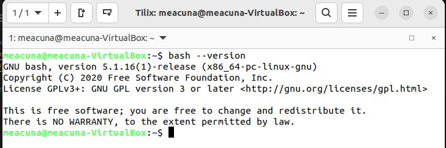
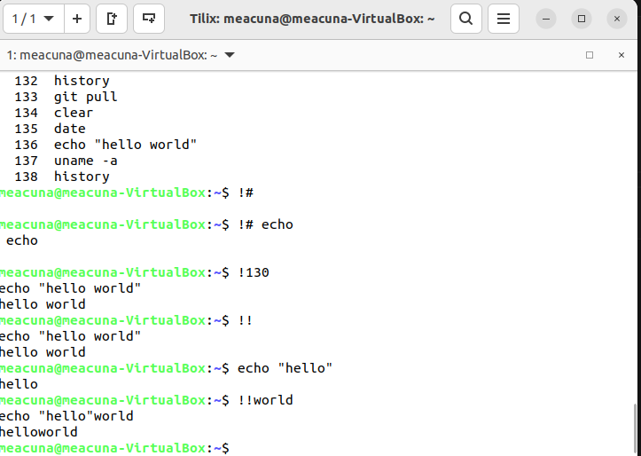
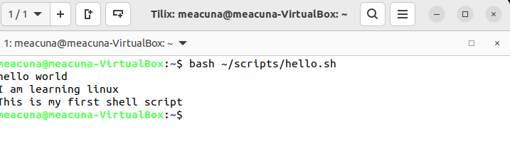
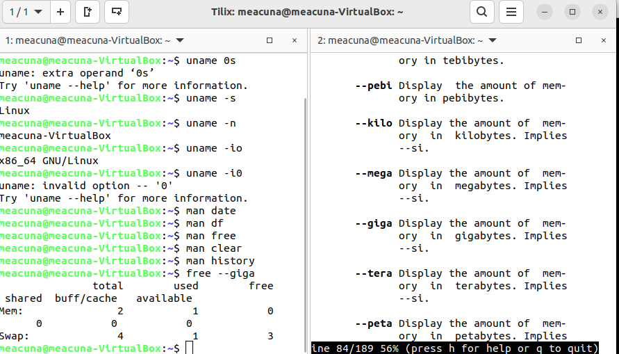
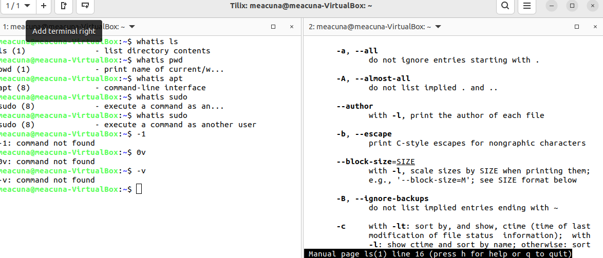
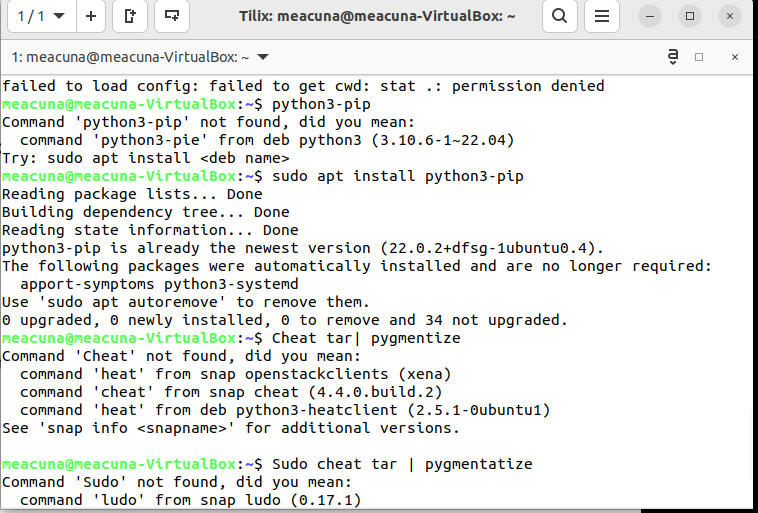

# Weekly Report 3
## Completed work for week 3 
* [Lab 3 ](../../labs/lab3/lab3.md)
* [Notes 1](../../notes/notes1/notes1.md)

### Practice 2: Accessing the Bash Shell

### Practice 3: Using the Command History

### Practice 4: My First Shell Script

### Practice 5: Using Man

### Practice 6: Using the Help Option

### Practice 7: Using Cheat!

### Pratice 1: Managing software

